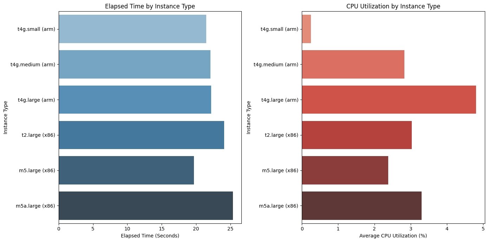

# AWS_Compare

    <h2 style="border-bottom: 1px solid #d8dee4; color: #282d33;"> 🧑‍💻 Compare Performance among Instance Types </h2>
    
 
        
        
    

    
 그래프와 표를 통해 각 인스턴스 유형에 따른 실행 시간과 CPU 사용률을 비교하고 연관성을 확인할 수 있습니다. 그래프에서 몇 가지 관찰 사항은 아래에 더 자세하게 작성했습니다:  
    실행 시간: m5.large (x86) 인스턴스가 가장 짧은 실행 시간을 보여줍니다. 이는 일반적으로 높은 컴퓨팅 성능을 나타낼 수 있습니다. 반면에 m5a.large (x86) 인스턴스는 가장 긴 실행 시간을 가지고 있어, 같은 'm5' 계열임에도 성능 차이가 있음을 나타냅니다.  
    CPU 사용률: t4g.large (arm) 인스턴스는 상대적으로 높은 CPU 사용률과 함께 중간 범위의 실행 시간을 보여줍니다. 이는 작업 처리를 위해 상당량의 CPU를 사용하지만, 그만큼의 성능 향상을 얻지 못하는 것으로 해석될 수 있습니다. t4g.small (arm)과 m5a.large (x86)은 매우 낮은 CPU 사용률을 보여줍니다. 이는 해당 인스턴스들이 CPU 자원을 효율적으로 활용하지 못하고 있거나, 작업이 CPU에 크게 의존하지 않는 것으로 볼 수 있습니다.  
    아키텍처의 영향: ARM 기반의 t4g 인스턴스들은 일관되게 낮은 CPU 사용률을 보이며, 이는 ARM 아키텍처의 전력 효율성이 더 뛰어날 수 있음을 시사합니다. t2.large (x86)는 x86 아키텍처를 기반으로 하며, ARM 기반 인스턴스와 비교했을 때 상대적으로 높은 CPU 사용률을 보이는 것으로 나타납니다.  
    성능 대비 비용: t2.large (x86)가 높은 CPU 사용률에도 불구하고 중간 범위의 실행 시간을 가지고 있음을 고려하면, 이 인스턴스 유형은 비용 대비 성능 면에서 덜 효율적일 수 있습니다. 반면, m5.large (x86)는 낮은 실행 시간과 중간 범위의 CPU 사용률을 보여주어 비용 대비 성능이 우수할 가능성이 있습니다.  
    이러한 관찰 사항은 인스턴스의 선택에 있어서 중요한 역할을 할 수 있으며, 특정 워크로드에 가장 적합한 인스턴스 유형을 결정하는 데 유용한 정보를 제공합니다. 그러나 최종 결정을 내리기 전에는 비용, 네트워크 성능, 메모리 용량, 저장소 성능 등 다른 요소들도 고려해야 된다고 생각합니다.   ​ 
    

