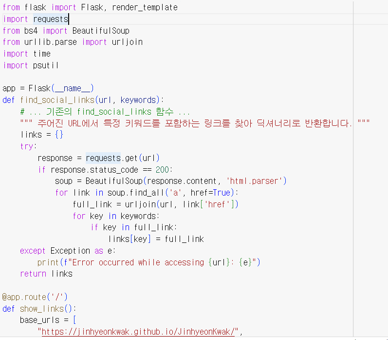
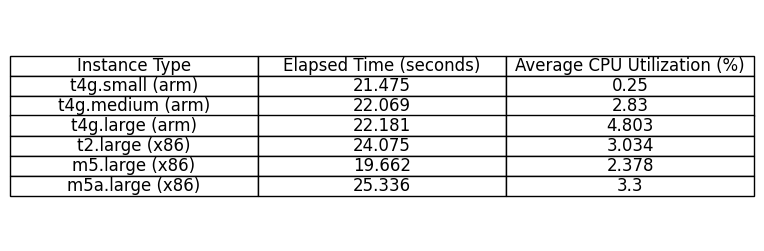

# AWS_Compare

    <h2 style="border-bottom: 1px solid #d8dee4; color: #282d33;"> 🧑‍💻 Compare Performance among Instance Types </h2>
    
 
        
        
    

    
 
        
        
    

    
 그래프와 표를 통해 각 인스턴스 유형에 따른 실행 시간과 CPU 사용률을 비교하고 연관성을 확인할 수 있습니다. 그래프에서 몇 가지 관찰 사항은 아래에 더 자세하게 작성했습니다:  
    실행 시간 (Elapsed Time):  
    빠름: m5.large (x86)는 가장 짧은 실행 시간을 기록했습니다. 즉, 주어진 작업을 완료하는 데 가장 적은 시간이 소요되었다는 것을 의미합니다. 이는 일반적으로 좋은 성능을 나타내며, 이 인스턴스가 작업을 처리하는 데 가장 효율적이었을 가능성이 높습니다.  
    느림: m5a.large (x86)는 가장 긴 실행 시간을 보여줍니다. 이는 이 인스턴스가 작업을 완료하는 데 더 많은 시간이 필요했음을 나타내며, 같은 작업을 수행함에 있어 상대적으로 성능이 낮을 수 있음을 의미합니다.  
    CPU 사용률 (Average CPU Utilization):   
    낮음: t4g.small (arm)은 0.25%의 매우 낮은 CPU 사용률을 보여주었습니다. 이는 이 인스턴스가 CPU 자원을 거의 사용하지 않았거나, CPU 요구 사항이 매우 낮은 작업을 수행했을 가능성이 있습니다.  
    높음: t4g.large (arm)는 비교적 높은 CPU 사용률을 기록했습니다. 이는 이 인스턴스가 주어진 작업을 수행하는 데 많은 CPU 자원을 사용했음을 나타냅니다. 그러나 실행 시간이 빠르지 않다는 점은, 높은 CPU 사용량이 반드시 빠른 처리 속도로 이어지지 않을 수 있음을 보여줍니다.  
    CPU 아키텍처의 영향:   
    ARM 기반 인스턴스(t4g 시리즈)와 x86 기반 인스턴스(t2, m5, m5a 시리즈) 간에는 성능과 효율성 면에서 차이가 있습니다. 예를 들어, ARM 인스턴스는 낮은 CPU 사용률을 보이는 반면, t2.large (x86)는 더 높은 사용률을 나타냅니다. 이는 아키텍처별로 최적화된 작업 유형이 다를 수 있음을 시사합니다.  
    성능 대비 비용:   
    실제 비용 대비 성능을 평가하려면, 인스턴스의 시간당 가격과 다른 리소스 사용량도 함께 고려해야 합니다. 낮은 CPU 사용률과 긴 실행 시간을 보이는 인스턴스는 비용 효율적이지 않을 수 있으며, 반대로 짧은 실행 시간과 적당한 CPU 사용률을 가진 인스턴스는 더 효율적일 수 있습니다.  
    결론적으로, 이 데이터를 통해 각 인스턴스 유형이 특정 작업에 얼마나 적합한지, 그리고 효율성과 비용 대비 성능을 어떻게 평가해야 하는지에 대한 인사이트를 얻을 수 있습니다. 그러나 이러한 관찰 사항은 인스턴스의 비용, 다른 리소스 사용률, 그리고 특정 워크로드의 특성을 충분히 고려할 때만 완전한 의미를 가질 수 있습니다.   ​ 
    

